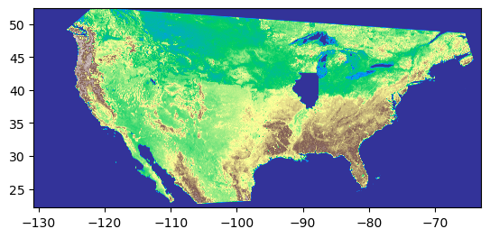

# Does accessing green space facilitate human well-beings? An examination from vegetation indexes in the US 

There are four jupyter notebooks for this project:  
`Gather_Health_Score.ipynb` for collecting physical and mental health indicators and convert them into compond scores.  
`Crop and Plot.ipynb` showcases different packages for geodata, and illustrates the crop and plot function for geodata.  
`Gather_Yearly_Vegetation_with_Dask.ipynb` for clipping and generating yearly vegetation indexes for each state, as well as modeling.  
`Gather_Monthly_Vegetation_with_Dask.ipynb` for clipping and generating monthly vegetation indexes for each state, as well as modeling.    

# Introduction

Research has shown that green space will improve our mental and physical health [1]. In this project, we would like to utilize large-scale computing to test the theory in a quantitative manner. As learned in class, large numbers of Landsat satellite scenes can be used to study land-use change. Only certain wavelengths of light can be received in human’s eyesight, but the multispectral scanners can capture the wavelengths we can’t see, for example, the infrared wavelengths. By processing and analyzing these different spectral wavelengths, we can identify the change of green space in a given area. 

NASA’s Moderate Resolution Imaging Spectroradiometer (MODIS) has been capturing the scenes at 16-day intervals and at multiple spatial resolutions, and it provides us with consistent spatial and temporal comparisons of vegetation canopy greenness. Two vegetation indices are derived from atmospherically-corrected reflectance in the red, near-infrared, and blue wavebands; the normalized difference vegetation index (NDVI), which provides continuity with NOAA's AVHRR NDVI time series record for historical and climate applications, and the enhanced vegetation index (EVI), which minimizes canopy-soil variations and improves sensitivity over dense vegetation conditions.

The two indices have therefore been widely employed in studies with vegetation or greenspace’s change. Since live green plants absorb solar radiation in the photosynthetically active radiation (PAR) spectral region, a strong absorption at some wavelengths would result in overheating the plant and possibly damaging the tissues, so live green plants appear relatively dark in the PAR and relatively bright in the near-infrared [2]. As such, we can utilize the NDVI and EVI data as a proxy of whether an area is green enough for our health. Considering data accessibility and time limits, we focus on the state-level data in the United States of the year 2018. This allows us to compare the effects among different sections, and in our case, cross-states. 

# Data and Methods

## Access Data

In order to attain our research target, we need to collect: (1) mental and physical data at the state level, (2) shapefile recording each state’s boundary in the US, and (3) NDVI and EVI data around the US. With (2) and (3) on hand, we are able to overlay two data layers and clip (crop) the common area so that we can have vegetation indexes at the state level.

First of all, we gathered human well-being data from CDC’s website [3]. The physical health indicators include heart disease mortality, cancer mortality, Alzheimer’s disease mortality, chronic lower respiratory disease mortality, stroke mortality, diabetes mortality. On the other hand, the mental health indicators incorporate suicide rate and death, and drug overdose death counts. In order to generate a dependent variable for regression models, we transferred all the data into mortality rate and calculated a compound physical health score and a compound mental health score.

Second, in order to clip the raster data, we acquired the boundary of US states from the US Census Bureau, which provides different resolution shapefiles. Noticeably, the shapefiles from the US census are usually in EPSG: 4269 projection, which indicates that we need to gather vegetation projection in the same format.

The final data we require is the vegetation index. We originally aimed to collect the vegetation coverage data from the USGS S3 bucket on AWS, which has already cleaned and transformed NASA’s NDVI and EVI indices [4]. However, the USGS S3 bucket does not allow for access from the `us-east-1` accounts; we instead switched to acquire the data directly from NASA’s earth science database [5]. Each file contains a batch of data spanning across a parallelogram area. Each batch contains 2400 * 2400 NDVI indices, where each unit of the NDVI index captures a 500 meter-wide by 500 meter-long region of the earth’s surface. 

(The pictures showcase the result of clip function. We read in the `tif` file, and clip the data within the state boundary (here Arkansas). We can see the hollow space in the first picture has the same shape as the second one.)  

We first tried to read the '.hdf' file from the NASA website; after pre-processing, we found it impossible to clip a full shape of a state when masking together with the shapefile of US states’ boundaries. The original projection is “sinusoidal”, which is different from what the shapefile stored. We thus chose the `.tif` file converted from the NASA website and found it close enough to clip the boundary of a state with NDVI information stored. One thing to note is that the EPSG [6] of the `.shp` file is stored in 4269 while the EPSG of the `.tif` we downloaded is stored in 4326. Strictly speaking, the two should be re-projected, but we approximated the two as our scope is broad enough at the state level. We validated our approach by successfully producing an approximate picture of the holistic view of the US's NDVI level.

(With the vegetation indexes data covering the US mainland, we can still do the clip function, and here is the example of Illinois.)

## Parallel Computing

There are many packages that can possibly handle and wrangle geodata, while we require an approach that has the potential to be parallel and thus scaled up for our research question. Since the vegetation indexes from satellite images covering the whole US are relatively large, the chunk feature from `Dask` can help us reduce the burden of computer memory. In the picture, we can see `Dask` will chunk the data and task into small pieces, and hold the implementation. Furthermore, the `xarray` and `rioxarry` packages, which have many useful functions to tackle geodata, have been integrated into `Dask`, and hence, we can process geodata using Dask with the ability to scale up for larger image files. The lazy implementation in Dask is also helpful for dealing with large image files since it will delay all the implementations until the user calls the .compute() function. This feature can again reduce the requirement of CPU and RAM, and further parallelize the process into small tasks.

We created a function to garner the average vegetation indexes. In the function, we used `rioxarray` to read the `.tif` file, clipping the raster data based on the boundary of each state. Noticeably, the shape “MultiPolygon” and “Polygon” are two boundary types (Polygon is not iterable), so we needed to solve this difference. After calling the clip function, the statement returns a Dask DataArray with vegetation indexes. For simplicity, we only need one overall vegetation index for each state, so we stacked the data array to be 1D, filtered out the invalid index (-3000 as NA in raw data), then executed `.compute()` to calculate the mean value.

For in total 23 `.tif` files covering 16-days each, we were able to create monthly and yearly vegetation indexes. For the monthly index, we combined two consecutive `.tif` files as one month, with February deriving from only one `.tif` file. Thus, we created the monthly NDVI score of each state during the year 2018. On the other hand, with dictionaries built, we stored each state’s average NDVI score across 16-days and summed them up, obtaining the yearly NDVI amount of each state. By transforming the dictionary back to list, we derived the yearly average. Finally, we integrated the vegetation indexes into the physical and mental data frames for further analysis.

(The following pictures demonstrate how `Dask` handle image data with `xarray`, `rioxarray`, and lazy implementation. `Dask` can read in `tif` file and divide it into small chuncks and hold the implementation. These features can allow us to parallelize and conduct the data processing more efficiently.)

## Model 

Now we have the data frames we need, we can build models to examine if more green space correlates to better human health. For an excerpt, the data frame looks as below:

| State | Health | NDVI_avg | NDVI_jan | … | EVI_avg | … | EVI_dec |
| :---: | :---: | :---: | :---: | :---: | :---: | :---: | :---: | 
| CA | 401.1 | 3824.72 | 3789.61 | … | 2023.82 | … | 1768.77 |
| IL | 434.8 | 4823.13 | 2663.30 | … | 3074.61 | … | 1588.68 |

For simplicity, states that are not contiguous in the US are not incorporated in the dataset (e.g. Hawaii, Alaska). Therefore, considering we only have 48 observations, it is not reasonable to follow the machine learning approach to split the data into training and test and build a prediction model. Instead, we can simply employ linear regression to observe the relationship between independent and dependent variables. Therefore, we utilized ordinary least squares (OLS) from `statsmodels` to create models.

The first trial we have is to use yearly vegetation indexes and yearly health scores to construct two models: one for physical health score and one for mental health. By examining the summary from both models, we found out there is no strong relationship between the vegetation indexes and human health, no matter physical or mental. That is, the p-values in both models are fairly large, which indicates the relationship between dependent and independent variables is not significant. This may be caused by the fact that we condensed every 16 days data into one year, which ignores the seasonal, vegetation, and scenic changes throughout the year. Hence, we employed the monthly vegetation indexes to rebuild the model. Nonetheless, since there is no monthly physical and mental disease data available, two models still demonstrate little to no information between the x and y variables.

(Model Summary of Physical health and Yearly Vegetation indexes)

(Model Summary of Mental health and Yearly Vegetation indexes)

(Model Summary of Physical health and Monthly Vegetation indexes)

(Model Summary of Mental health and Monthly Vegetation indexes)

# Conclusion 

There are some limitations in our models rendering this outcome. The first limitation of our project lies in the fact that health outcome data is not granular enough. We cannot capture the seasonal effect of greenspace if we could not have human health data on a monthly level. Second, NDVI and EVI on a state level might still cover too much area for analysis. That is, there are many different environmental features in one state, and simply adding them up and averaging them cannot really indicate a person’s accessibility to green space.

Overall, with the data we have in 2018, we did not find the claimed relationship between green space and human well-being, either physical or mental, which contradicts the theory in the previous research. Even though there are some limitations on our models, our approach can still provide a simplified and parallel way to examine the hypothesis: humans will be healthier if being able to access more green space. For further improvement, we can gather monthly health information if possible, or we can still build a model on a yearly level, but covering the time span for decades, which can reflect the relationship between environmental transformation and human well-being.

# References

[1] Barton, J., & Rogerson, M. (2017). The importance of greenspace for mental health. BJPsych International, 14(4), 79–81. https://doi.org/10.1192/s2056474000002051 

[2] Gates, David M. (1980) Biophysical Ecology, Springer-Verlag, New York, 611 p.

[3] CDC’s stats of the states: https://www.cdc.gov/nchs/pressroom/stats_of_the_states.htm

[4] MODIS Vegetation Indices on AWS: https://registry.opendata.aws/modis-astraea/ 

[5] NASA’s Earth Database: https://urs.earthdata.nasa.gov/oauth/authorize?client_id=ZAQpxSrQNpk342OR77kisA&response_type=code&redirect_uri=https://lpdaacsvc.cr.usgs.gov/appeears/login&state=download/9f8bb051-aa93-4d43-87a2-9e11f9b0d011

[6] EPSG is the coordinate system worldwide. It is a public registry of geodetic datums, spatial reference systems, Earth ellipsoids, coordinate transformations, and related units of measurement. 

[7] Su, J. G., Dadvand, P., Nieuwenhuijsen, M. J., Bartoll, X., & Jerrett, M. (2019). Associations of green space metrics with health and behavior outcomes at different buffer sizes and remote sensing sensor resolutions. Environment international, 126, 162-170.
